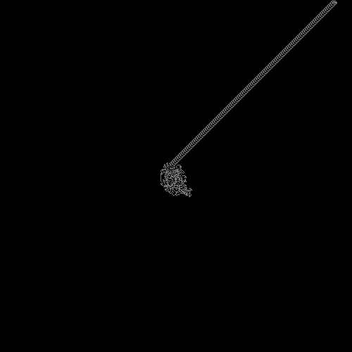
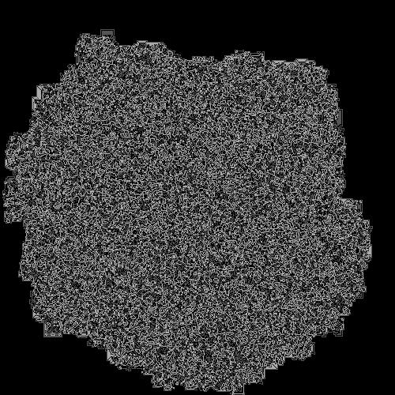
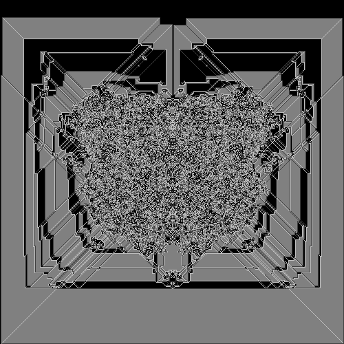

What is this?
=============

This is a simple implementation of [Langton's Ant](https://en.wikipedia.org/wiki/Langton%27s_ant). Langton's ant is a two-dimensional universal Turing machine. Each ant is defined by a bitstring which has at least one zero and one one.

The classical ant is the two-bit string ```10```. After some time, it builds a repetitive pattern ("highway") and will leave the board.


There are other behaviours, too. The ant ```100``` will be chaotic and slowly, but steadily grow.


The ant ```10001``` is somehow chaotic, but also has some patterns. It slowly and steadily grows until it leaves the board.


This program takes any bitstring (<256 bits) as input and outputs an image in [Portable Greymap Format](https://en.wikipedia.org/wiki/Netpbm_format). It will stop when the ant leaves the board or when the step count exceeds one billion.

Compilation
===========

Should be as easy as typing ```make``` or ```gcc -O3 -o ant ant.c```.

Usage
=====

```
./ant 10 25
    Simulate Langton's Ant 10 on a quadratic board with size 25x25

./ant 110
    Same as above, but with default board size of 500
```

